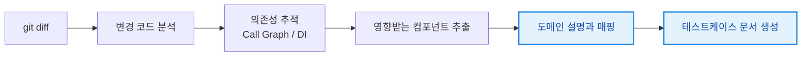

# test-impact-analysis

## 사용 상황

다음 상황에서 이 스킬을 사용합니다.

- PR 변경사항을 기준으로 영향받는 컴포넌트를 추출해야 할 때
- 전체 테스트가 아니라 변경 영향 기반으로 테스트 후보를 좁히고 싶을 때
- Java / Spring 기반 프로젝트에서 Call Graph, DI, Mapper 참조를 활용해 테스트 영향 범위를 분석하고 싶을 때
- 도메인 설명과 변경사항을 연결해서 사람이 바로 돌려볼 수 있는 테스트케이스 문서를 만들어야 할 때

## 입력 파라미터

필수 입력은 PR 주소입니다. 도메인 설명 파일은 선택입니다.

```bash
./scripts/tia-impact.sh <PR_URL> [DOMAIN_FILE]
```

예시:

```bash
./scripts/tia-impact.sh \
  https://github.com/org/repository/pull/123 \
  ./skills/test-impact-analysis/references/domain-context.md
```

도메인 설명 파일은 이 스킬의 [references/domain-context.template.md](./references/domain-context.template.md)를 복사해서 프로젝트 상황에 맞게 작성합니다.

도메인 파일 없이도 실행할 수 있습니다.

```bash
./scripts/tia-impact.sh https://github.com/org/repository/pull/123
```

## 실행 원칙

이 스킬은 다음 책임 분리를 따릅니다.



- `git diff`, 변경 코드 분석, Call Graph / DI 기반 영향 컴포넌트 추출은 스크립트가 수행합니다.
- 도메인 설명과 변경사항 매핑, 테스트케이스 문서 작성은 AI가 수행합니다.
- AI는 전체 코드를 무작정 읽지 않고, 스크립트가 생성한 영향 분석 리포트를 우선 사용합니다.
- 도메인 설명 파일이 없으면 AI는 코드 구조와 변경 영향만으로 테스트케이스를 만들고, 가정과 누락 가능성을 명시합니다.

## 실행 순서

1. 사용자가 PR 주소를 전달합니다.
2. 필요하면 사용자가 도메인 설명 파일을 준비합니다.
3. `scripts/tia-impact.sh <PR_URL> [DOMAIN_FILE]`을 실행합니다.
4. 스크립트가 PR의 base/head 정보를 기준으로 diff를 수집합니다.
5. 변경된 Java 파일, 클래스, 메서드 후보를 추출합니다.
6. 프로젝트 내 Java 파일을 스캔하여 Call Graph 후보를 생성합니다.
7. Spring DI 어노테이션과 생성자 주입, 필드 주입, Mapper 참조를 분석합니다.
8. 영향받는 컴포넌트 후보를 추출합니다.
9. 결과를 `tia-report.md`로 생성합니다.
10. AI는 `tia-report.md`와 도메인 설명 파일이 있으면 함께 읽고 `tia-test-cases.md`를 작성합니다.

## AI가 해야 할 일

AI는 다음 작업만 수행합니다.

- 영향 컴포넌트 목록을 바탕으로 테스트 후보 선정
- 단위 테스트 / 통합 테스트 / 회귀 테스트 분류
- 변경 내용의 비즈니스 의미 해석
- 도메인 설명이 있으면 변경사항과 연결
- 도메인 설명이 없으면 클래스명, 메서드명, 호출 관계를 기반으로 시나리오 추정
- 사람이 직접 수행할 수 있는 테스트 단계 작성
- 기대 결과와 실패 리스크 명시
- 가정과 저신뢰 구간 명시
- 과도한 테스트 제외
- 누락 가능성이 있는 테스트 추가
- `tia-test-cases.md` 작성

## AI가 하지 말아야 할 일

- 전체 저장소를 무작정 읽지 않습니다.
- diff 원문만 보고 영향 범위를 단정하지 않습니다.
- 스크립트가 추출한 Call Graph / DI 결과를 무시하지 않습니다.
- 테스트 실행 여부를 확정적으로 보장하지 않습니다.
- 분석 근거 없이 “전체 테스트 실행”만 권장하지 않습니다.
- PR 코멘트 형식으로만 결과를 축약하지 않습니다.

## 출력 형식

AI는 최종 답변을 요약으로 남기고, 실제 산출물은 `tia-test-cases.md` 파일로 작성합니다.

파일 형식은 다음 구조를 따릅니다.

```md
# TIA 테스트케이스

### 변경 요약
- ...

### 도메인 매핑
- 변경 클래스/메서드 -> 도메인 흐름 연결
- 도메인 설명이 없으면 추정 기반이라고 명시

### 영향받는 컴포넌트
- ...

### 테스트케이스 목록
| ID | 구분 | 시나리오 | 사전조건 | 절차 | 기대결과 |
|---|---|---|---|---|---|
| TC-01 | 통합 | ... | ... | 1. ...<br>2. ... | ... |

### 제외한 테스트
- ...

### 리스크 메모
- ...

### 가정
- 도메인 설명이 없을 때 어떤 추정을 기반으로 작성했는지
```

## 주의사항

- Java / Spring 프로젝트를 우선 대상으로 합니다.
- Reflection, 런타임 프록시, AOP, 이벤트 기반 흐름은 일부 누락될 수 있습니다.
- MyBatis XML과 외부 API 호출은 이름 기반 후보로만 추정합니다.
- 최종 테스트 선정과 테스트 단계 작성은 AI의 의미 기반 판단을 거칩니다.
- 도메인 설명 파일 품질이 낮으면 테스트케이스 품질도 낮아질 수 있습니다.
- 도메인 설명 파일이 없으면 테스트케이스는 구조 기반 추정이 많아집니다.
